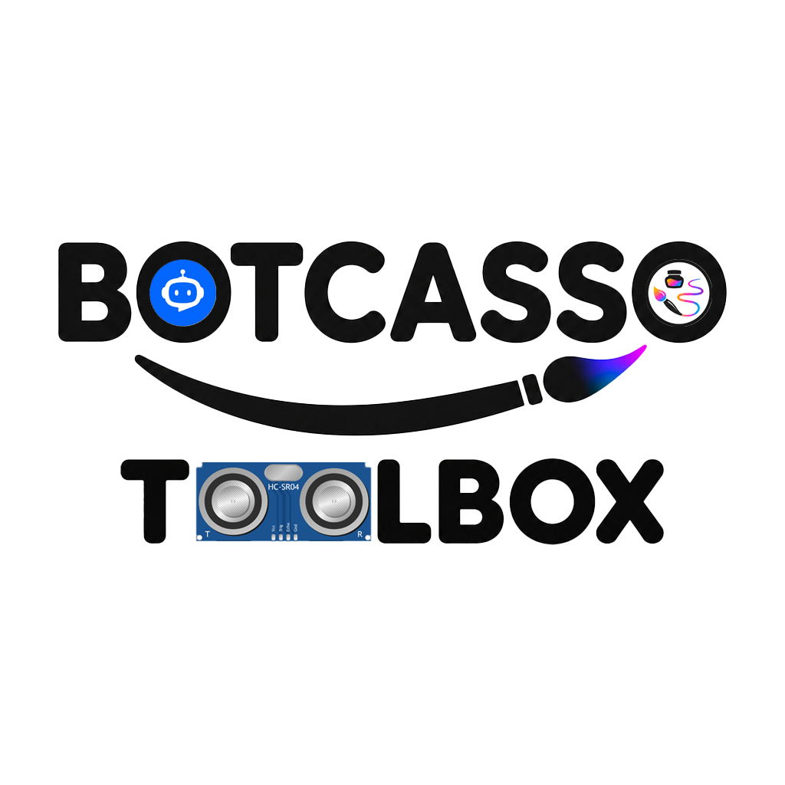

# 🤖 Botcasso Toolbox: Elegoo AI Assistant V4.0

**Botcasso Toolbox** is a premium, state-of-the-art web platform designed specifically for the **ELEGOO Smart Robot Car Kit V4.0**. It combines a sophisticated AI Chat interface with a real-time technical documentation engine to streamline robotic development and debugging.

Built with a focus on aesthetics, security, and performance, this toolbox is the ultimate companion for students and hobbyists working with the Elegoo ecosystem.

---

## ✨ Key Features

### 🧠 Specialized AI Core
*   **Hardware-Aware Logic**: The AI is pre-configured with the exact pin mappings, drivers (TB6612), and sensor specifications of the V4.0 kit.
*   **Code Generation**: Instant Arduino/C++ code for obstacle avoidance, line tracking, Bluetooth control, and more.
*   **Technical Debugging**: Upload compilation errors and get precise solutions based on the official manufacturer documentation.

### 🔐 Enterprise-Grade Security
*   **Supabase Auth Integration**: Secure login system with exclusive registration support (restricted to authorized domains like `@alumnos.unican.es`).
*   **Secure API Proxying**: API keys are never exposed on the client side. Requests are proxied through **Supabase Edge Functions** using JWT verification.
*   **Persistent Multi-User History**: Conversations are saved per account, allowing users to pick up where they left off from any device.

### 📖 Interactive Technical Docs
*   **Searchable Pin Mapping**: Quick access to every hardware connection (Servos, Motors, IR, Ultrasonic).
*   **Live Specs Dashboard**: Real-time reference for voltage detection, RGB status, and peripheral logic.
*   **Premium UI/UX**: Designed with a "Luxury Tech" aesthetic featuring dark mode, glassmorphism, and fluid Framer Motion animations.

### 🚀 Static & Optimized Architecture
*   **GitHub Pages Native**: Fully optimized for static deployment on GitHub Pages (using Next.js `output: export`).
*   **Lightning Fast**: Zero server overhead, served globally via CDN with optimized image handling.

---

## 🛠️ Technology Stack

*   **Frontend**: Next.js 15 (App Router), React 19, Tailwind CSS 4.
*   **Animations**: Framer Motion.
*   **Backend/Security**: Supabase (Auth, Database, Edge Functions).
*   **AI Engine**: OpenRouter (DeepSeek-Chat) with specialized hardware system prompting.

---

## 📦 Deployment Overview

This project is architected to run on **GitHub Pages** while maintaining full backend functionality via **Supabase**.

1.  **Static Export**: The project generates optimized HTML/JS bundles via `npm run build`.
2.  **Edge Functions**: All AI calls are handled by the `chat-proxy` edge function, ensuring the OpenRouter API key stays in a secure vault.
3.  **Auth Gateway**: Client-side authentication checks ensure that restricted pages (Chat, Docs) are only accessible to verified university members.

---

## 🎓 University Exclusive
This platform is currently configured to support exclusive access for **Universidad de Cantabria (UNICAN)** students. The registration flow validates academic emails and requires verification to unlock the AI tools.

---

## 📄 License
Custom Proprietary License. Created by **minijbs07**.

---

*“Turning code into motion with the power of AI.”*
